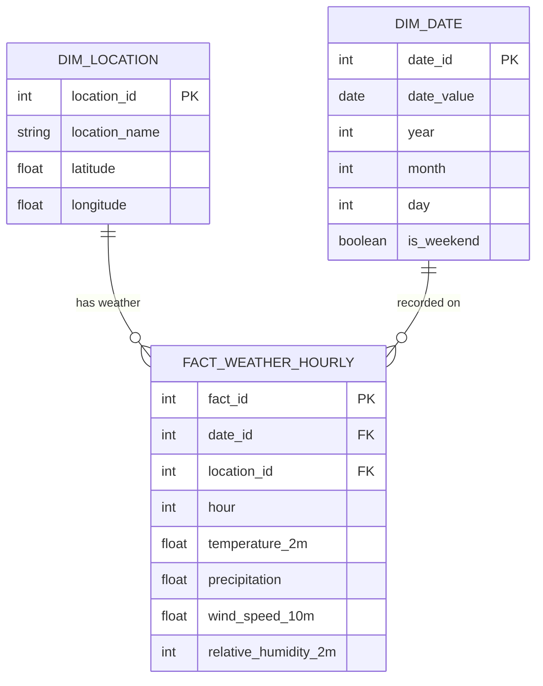

# e2e-de

[](https://github.com/j-alleva/e2e-de/actions/workflows/ci.yml)

End-to-end data engineering platform demonstrating production-grade ingestion, transformation, orchestration, and analytics.

**Status:** Blocks 1-4 Complete | Dockerized Python Ingestion + CI/CD + Postgres Staging + AWS S3 Data Lake

### Tech Stack
- **Languages:** Python (Pandas, PyArrow, Boto3), SQL(PostgreSQL)
- **Tools:** Docker, Docker Compose, Git/GitHub, GitHub Actions, Make, Pytest, Ruff, Mypy
- **Storage:** PostgreSQL (dockerized), Local Data Lake, AWS S3
- **Planned:** Spark/AWS Glue, Snowflake, dbt, Airflow, Streamlit

---

## Architecture

```
API (Open-Meteo)
    --> Python CLI (fetch --> validate --> normalize)
        --> Local Data Lake (Bronze JSON --> Silver Parquet)
            --> [Optional] AWS S3 Backup (Bronze/Silver)
            --> Postgres (raw_weather staging --> dim/fact star schema)
                --> Analytical SQL queries
```

**Target Architecture (end of project):**

```
API --> Dockerized Python Ingestion --> S3 (bronze/silver)
    --> AWS Glue Spark --> S3 (gold/curated Parquet)
        --> Snowflake COPY INTO --> dbt (staging/marts + tests + metrics)
            --> Streamlit dashboard
```

---

## Block 1: Python Ingestion Pipeline

Built a parameterized ingestion job with schema validation and reproducible run-date partitioning; writes raw JSON and cleaned Parquet outputs with logging.

### What's Implemented

- **Parameterized CLI** - Run pipeline for any date/location combination
- **Bronze Layer** - Raw JSON from Open-Meteo API (immutable, partitioned by run_date)
- **Silver Layer** - Cleaned Parquet with schema validation and type normalization
- **Data Quality** - Schema compliance checks, duplicate detection on natural key (location + timestamp)
- **Idempotent** - Re-running the same run_date overwrites outputs deterministically
- **Logging** - Console + file output with record counts at each stage
- **Docstrings** - Google-style documentation throughout

### Quick Start

**Prerequisites:**

- Python 3.9+
- Docker and Docker Compose

**Setup:**

1. Clone and install dependencies

```bash
git clone https://github.com/j-alleva/e2e-de.git
cd e2e-de
pip install -r requirements.txt
```

2. Configure environment (optional)

```bash
cp .env.example .env
```

3. Run the ingestion pipeline

```bash
make ingest RUN_DATE=2026-01-31 LOCATION=Boston
```

Or without Make:

```bash
python -m src.pipeline.run --run-date 2026-01-31 --location Boston
```

**Expected Output:**

Bronze (raw JSON):

```
data/bronze/source=openmeteo/run_date=2026-01-31/location=Boston/raw.json
```

Silver (cleaned Parquet):

```
data/silver/source=openmeteo/run_date=2026-01-31/location=Boston/weather_data.parquet
```

Logs:

```
pipeline.log
```

### Data Lake Structure

```
data/
├── bronze/                          # Raw, immutable source data
│   └── source=openmeteo/
│       └── run_date=YYYY-MM-DD/
│           └── location=Boston/
│               └── raw.json
│
└── silver/                          # Cleaned, validated, analysis-ready
        └── source=openmeteo/
                └── run_date=YYYY-MM-DD/
                        └── location=Boston/
                                └── weather_data.parquet
```

---

## Block 2: Postgres Staging + SQL Analytics

Modeled and queried a weather dataset in a Dockerized Postgres warehouse using a star schema with dimension and fact tables, plus 13 analytical queries demonstrating GROUP BY, JOINs, window functions, CTEs, and rolling aggregates.

### Data Model

Star schema designed for hourly weather analytics:

| Table | Type | Description |
|---|---|---|
| `raw_weather` | Staging | Raw ingested data from silver Parquet (temporary, refreshed per run) |
| `dim_date` | Dimension | Date attributes (day of week, month, weekend flag) |
| `dim_location` | Dimension | Location details (city, latitude, longitude) |
| `fact_weather_hourly` | Fact | Hourly weather measurements joined to dimensions (24 rows/day) |

### Schema Diagram


### Running the Warehouse Locally

```bash
# Start Postgres in Docker
make up

# Create schema (dimensions, facts, staging)
make schema

# Ingest data and load into raw_weather staging table
make ingest RUN_DATE=2026-01-31 LOCATION=Boston
make load RUN_DATE=2026-01-31 LOCATION=Boston

# Populate fact and dimension tables from staging
make warehouse

# Run all 13 analytical queries
make queries

# Tear down
make down
```

### Analytical Queries

13 SQL queries in `sql/queries/` demonstrating a range of SQL techniques. All queries tested and validated in Docker Postgres:

| Query | Description | Techniques |
|---|---|---|
| `q1_sample_data.sql` | Sample data inspection | SELECT, LIMIT |
| `q2_freezing_hours.sql` | Hours below freezing | WHERE, filtering |
| `q3_high_winds.sql` | High wind events | Conditional filtering |
| `q4_weekend_weather.sql` | Weekend vs weekday patterns | JOIN, GROUP BY |
| `q5_avg_temp_by_city.sql` | Average temperature by city | GROUP BY, aggregation |
| `q6_min_max_temp.sql` | Daily temperature range | MIN, MAX, GROUP BY |
| `q7_rainy_cities.sql` | Cities ranked by rainfall | GROUP BY, HAVING, ORDER BY |
| `q8_temp_buckets.sql` | Temperature distribution | CASE, bucketing |
| `q9_hourly_temp_change.sql` | Hour-over-hour temperature delta | LAG window function |
| `q10_rolling_avg_temp.sql` | Rolling average temperature | Window frame (ROWS BETWEEN) |
| `q11_hottest_hour_rank.sql` | Hottest hour ranking per location | RANK, PARTITION BY |
| `q12_cumulative_rainfall.sql` | Cumulative daily rainfall | SUM window function |
| `q13_extreme_weather_cte.sql` | Extreme weather event detection | CTE, conditional logic |

### SQL File Structure

```
sql/
├── postgres/
│   ├── 01_create_tables.sql       # Staging + star schema DDL
│   └── 02_populate_tables.sql     # Fact/dimension population from staging
└── queries/
        ├── q1_sample_data.sql
        ├── q2_freezing_hours.sql
        ├── ...
        └── q13_extreme_weather_cte.sql
```

---

## Block 3: Hybrid Cloud Storage (S3)

Extended the local ingestion pipeline to support hybrid cloud storage. Implemented a custom `s3.py` client using `boto3` to push Bronze and Silver artifacts to AWS S3, secured by a custom Least Privilege IAM policy.

### What's Implemented

- **Hybrid I/O** - Pipeline supports optional `--write-s3` flag to mirror local files to the cloud
- **Least Privilege Security** - Custom IAM policy restricting the programmatic user to specific bucket actions (`PutObject`, `GetObject`) only
- **Hive Partitioning** - S3 keys mirror the local directory structure (`source=.../run_date=...`) to prepare for Spark querying
- **Infrastructure as Code** - Documented storage patterns and security policies in `infra.md`

### Running with S3

```bash
# Ingest and automatically upload to S3
make ingest-s3 RUN_DATE=2026-02-11 LOCATION=Boston
```

## Block 4: Dockerization & CI/CD

Packaged the ingestion pipeline into a reproducible Docker container and implemented strict code hygiene and automated testing via GitHub Actions.

### What's Implemented
- **Containerization:** Pipeline runs in an isolated Python slim Docker container, eliminating local environment dependencies.
- **CI/CD Automation:** GitHub Actions workflow (`ci.yml`) runs automatically on every push
- **Unit Testing:** Deterministic unit tests using `pytest` and mock data to validate schema enforcement, edge cases, and data normalization logic.
- **Code Hygiene:** Strict linting with `ruff` and static type checking with `mypy` enforced in the CI pipeline.
- **Secure Credential Injection:** AWS credentials securely passed at runtime via `.env` file mapping, ensuring zero secret leakage in the Docker image.

### Running with Docker

```bash
docker build -t de-ingest .
docker run --env-file .env de-ingest --run-date 2026-01-31 --location Boston
```
## Project Structure (Current)

```
e2e-de/
├── .github/workflows/
│   └── ci.yml                     # GitHub Actions CI/CD pipeline
├── src/pipeline/
│   ├── config.py                  # Environment config + path generation
│   ├── run.py                     # CLI entry point (ingestion)
│   ├── load.py                    # Silver Parquet --> Postgres loader
│   ├── ingest/
│   │   ├── fetch.py               # API extraction --> bronze
│   │   ├── validate.py            # Schema + data quality checks
│   │   └── normalize.py           # Bronze --> silver transformation
│   ├── io/
│   │   ├── local.py               # Local filesystem I/O (Currently Empty)
│   │   └── s3.py                  # AWS S3 I/O wrapper (boto3)
│   └── transform/
│       └── pandas_transform.py    # Python-based transformations
├── docs/adr/ # ADR files 
├── tests/
│   ├── test_config.py             # Pytest unit tests (config)
│   └── test_pipeline.py           # Pytest unit tests (validation & normalization)
├── sql/
│   ├── postgres/                  # DDL and population scripts
│   └── queries/                   # Analytical SQL queries
├── Dockerfile                     # Python containerization blueprint
├── conftest.py                    # Pytest configuration file
├── docker-compose.yml             # Postgres service definition
├── infra.md                       # Cloud architecture & security docs
├── Makefile                       # Single-command developer experience
├── requirements.txt               # Python dependencies
└── .env.example                   # Configuration template
```

### Key Design Patterns

- **Idempotency:** Re-running the same run_date overwrites outputs (S3 writes will use deterministic keys; Snowflake will use staging + MERGE)
- **Partitioning:** All outputs partitioned by `run_date` for backfill support
- **Staged Ingestion:** Raw data flows through staging before analytics tables
- **Validation:** Schema compliance and data quality checks before transformation
- **Natural Key:** `(location, timestamp)` used for duplicate detection
- **I/O Abstraction:** Storage backends abstracted via `src/pipeline/io/` to avoid hardcoded paths

### Environment Variables

See `.env.example` for the full configuration template.

| Variable | Default | Description |
|---|---|---|
| `LOCAL_BRONZE_PATH` | `./data/bronze` | Bronze layer storage path |
| `LOCAL_SILVER_PATH` | `./data/silver` | Silver layer storage path |
| `LOCAL_GOLD_PATH` | `./data/gold` | Gold layer storage path (placeholder) |
| `OPEN_METEO_URL_TEMPLATE` | (see .env.example) | API endpoint template |
| `AWS_ACCESS_KEY_ID` | (user-supplied) | Your AWS Access Key |
| `AWS_SECRET_ACCESS_KEY` | (user-supplied) | AWS programmatic user secret |
| `AWS_BUCKET_NAME` | (user-supplied) | S3 bucket name |
| `AWS_REGION` | (user-supplied) | AWS region (e.g., us-east-2) |

### Make Commands

```bash
make help                                    # Show all available commands
make up                                      # Start Docker services (Postgres)
make down                                    # Stop Docker services
make ingest RUN_DATE=2026-01-31 LOCATION=Boston     # Run Dockerized Python ingestion pipeline
make ingest-s3 RUN_DATE=2026-01-31 LOCATION=Boston  # Run Dockerized ingestion + upload to S3
make schema                                  # Create Postgres schema (staging + dimensions + facts)
make load RUN_DATE=2026-01-31 LOCATION=Boston       # Load silver Parquet into Postgres staging
make warehouse                               # Populate fact/dimension tables from staging
make queries                                 # Run all 13 analytical queries
make clean                                   # Remove local data lake files
```

---

## Troubleshooting

**Problem:** `ModuleNotFoundError: No module named 'src'`
**Solution:** Run from project root using `python -m src.pipeline.run ...`

**Problem:** `FileNotFoundError` when running pipeline
**Solution:** The pipeline creates directories automatically. Ensure you are in the project root.

**Problem:** API request fails
**Solution:** Check internet connection. Open-Meteo is public and requires no API key.

**Problem:** Postgres connection refused
**Solution:** Ensure Docker is running and the container is up: `make up`

---

## Roadmap

- [x] **Block 1** - Python ingestion + cleaning (local bronze/silver data lake)
- [x] **Block 2** - SQL foundations + star schema modeling (Postgres in Docker)
- [x] **Block 3** - AWS S3 data lake layout with IAM + partitioned uploads
- [x] **Block 4** - Dockerize ingestion + GitHub Actions CI (lint, test, type hint)
- [ ] **Block 5** - Airflow orchestration (DAG with parameterized run_date, retries, backfills)
- [ ] **Block 6** - Spark transformations via AWS Glue (silver to gold, partitioned Parquet)
- [ ] **Block 7** - Snowflake warehouse load (stage + COPY INTO + MERGE for idempotency)
- [ ] **Block 8** - dbt transformations, tests, and documentation on Snowflake
- [ ] **Block 9** - Semantic metrics layer (dbt) + end-to-end Airflow DAG
- [ ] **Block 10** - Streamlit dashboard consuming dbt marts/metrics

---

## Status

| Milestone | Status |
|---|---|
| Block 1: Python Ingestion | Complete |
| Block 2: Postgres + SQL | Complete |
| Block 3: S3 + IAM Security | Complete |
| Block 4: Docker & CI/CD | Complete |
| Blocks 5-10 | Planned |

**Last Updated:** February 2026

**License:** MIT
