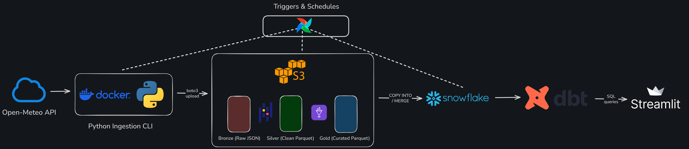
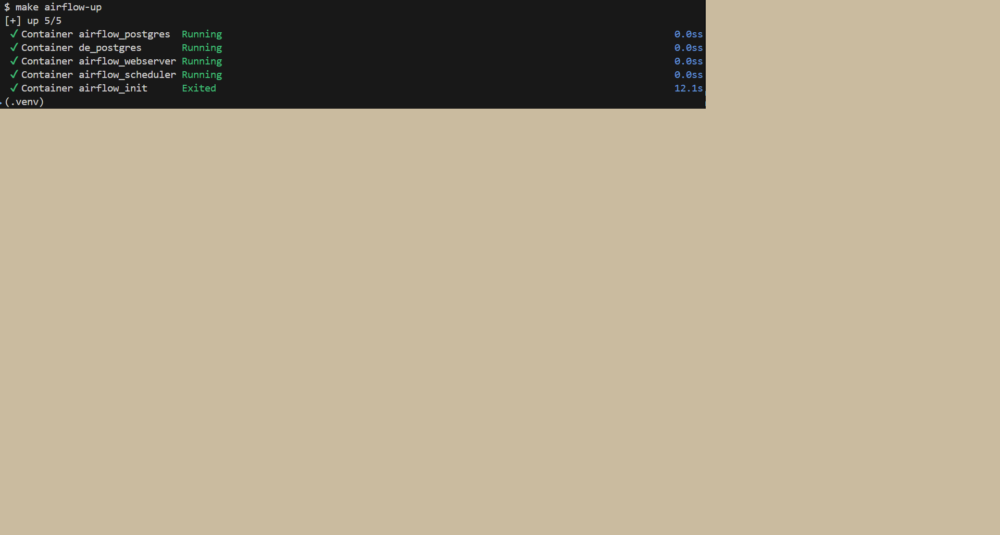

# e2e-de

[](https://github.com/j-alleva/e2e-de/actions/workflows/ci.yml)



End-to-end data engineering portfolio project covering parameterized ingestion, layered validation, lake storage, Spark transformation, Snowflake loading, dbt modeling, semantic metrics, and dashboard consumption. The pipeline fetches weather data from Open-Meteo, writes Bronze and Silver artifacts locally and optionally to S3, curates Gold data with AWS Glue, loads Snowflake with idempotent `MERGE` logic, builds dbt staging and mart models plus a semantic layer with metrics and a MetricFlow time spine, and serves a Streamlit dashboard. The full cloud path is orchestrated through Apache Airflow and supports historical backfills.



---

## Tech Stack

- **Orchestration:** Apache Airflow (Docker-based, daily scheduling, retry and backfill support)
- **Ingestion:** Python (`requests`, Pandas, PyArrow, Boto3)
- **Transformation:** PySpark via AWS Glue, dbt on Snowflake
- **Storage:** Local Bronze/Silver lake, AWS S3 Bronze/Silver/Gold, Snowflake warehouse
- **Analytics:** Streamlit (direct Snowflake connection with cached queries)
- **DevOps:** Docker, Docker Compose, GitHub Actions, Make, Ruff, mypy, pytest
- **Languages:** Python, SQL, YAML

---

## Operational Docs

The project includes separate operational documentation for runtime behavior, costs, and failure handling:

- **[Current Operational Design & Failure Modes](docs/production_design.md)** — implemented resiliency patterns, rerun behavior, and data quality controls
- **[System Costs & Hard Limits](docs/costs_and_limits.md)** — verified configuration, observed runtime, and conservative pricing guidance
- **[Pipeline Runbook & Operations Guide](docs/runbook.md)** — local setup, backfill workflow, and troubleshooting steps

---

## Quick Start

The documented commands assume a Bash-compatible shell. On Windows, prefer Git Bash or WSL so the Makefile targets and multiline commands run as written.

```bash
# Clone and install dependencies
git clone https://github.com/j-alleva/e2e-de.git
cd e2e-de
pip install -r requirements.txt

# Create local configuration
cp .env.example .env

# Build the ingestion image
make build

# Initialize Airflow metadata (first run only)
make airflow-init

# Start Airflow, scheduler, and Postgres
make airflow-up

# Access Airflow at http://localhost:8080
# Username: airflow
# Password: airflow
```

To run the Streamlit dashboard locally:

```bash
# Copy the template and add your Snowflake connection values
cp streamlit/.streamlit/secrets.toml.example streamlit/.streamlit/secrets.toml

# Start the dashboard
make app
```

Dashboard URL:

- `http://localhost:8501`

To run a single ingestion job outside the Airflow DAG:

```bash
make ingest RUN_DATE=2026-01-31 LOCATION=Boston
```

---

## Architecture & Data Flow

The implemented project follows a six-stage ingestion-to-consumption path:

1. **API Extraction (Bronze)** — The Python ingestion job fetches hourly weather data from Open-Meteo, writes raw JSON to the local Bronze layer, and can optionally mirror that partitioned output to S3.

2. **Validation & Normalization (Silver)** — Python validation checks for required top-level keys, parseable timestamps, and duplicate natural keys before Pandas normalization writes cleaned Parquet to the Silver layer.

3. **Distributed Curation (Gold)** — AWS Glue PySpark reads Silver Parquet from S3, renames and standardizes key fields, derives analytics-ready columns, performs a Silver-to-Gold row count check, and writes partitioned Gold Parquet.

4. **Warehouse Load (Snowflake)** — Snowflake reads Gold Parquet through an external stage, loads a transient staging table with `COPY INTO`, and uses `MERGE` statements to upsert into `dim_date`, `dim_location`, and `fact_weather_hourly`.

5. **Analytics Transformation (dbt)** — dbt builds staging views, the `mart_daily_weather_summary` mart, and a semantic layer defined through `metrics.yml` and `metricflow_time_spine.sql`, with mart-level `unique`, `not_null`, and `relationships` tests.

6. **Consumption Layer (Streamlit)** — The dashboard queries the final mart table in Snowflake, renders KPI cards and charts, and caches result sets to reduce repeated warehouse access.

The full cloud path is orchestrated by Airflow using `DockerOperator`, `GlueJobOperator`, and `SnowflakeOperator`, parameterized by the logical execution date `{{ ds }}` for safe reruns and backfills.

---

## Additional Local SQL Workflow

The repository also includes a local PostgreSQL staging and analytics workflow used for star-schema modeling and SQL query practice.

```bash
# Start local Postgres only
docker compose up -d postgres

# Create warehouse schema
make schema

# Produce Silver data and load it into Postgres staging
make ingest RUN_DATE=2026-01-31 LOCATION=Boston
make load RUN_DATE=2026-01-31 LOCATION=Boston

# Populate dimensions and facts
make warehouse

# Run saved analytical queries
make queries
```

This local path is separate from the Snowflake/dbt production-style flow, but it remains part of the repo as a useful modeling and SQL analytics module.

---

## Key Engineering Patterns

- **Idempotent Reruns** — Airflow passes `{{ ds }}` into the ingestion and transformation steps, S3 partition paths are deterministic, and Snowflake loads use `MERGE` on business keys so the same logical date can be processed again without duplicating warehouse rows.

- **Layered Data Quality Checks** — Bronze validation runs in Python before normalization, the Glue job performs a Silver-to-Gold row count check, and dbt enforces mart-level `unique`, `not_null`, and `relationships` assertions on Snowflake.

- **Task Isolation** — Airflow runs ingestion and dbt in isolated Docker containers, executes Spark work through AWS Glue, and performs warehouse loading through Snowflake operators.

- **Least-Privilege AWS Access** — The documented IAM policy in [infra.md](infra.md) limits the programmatic user to the project bucket and scoped S3 actions (`PutObject`, `GetObject`, and `ListBucket`).

- **Operational Recoverability** — The pipeline can be rerun for a failed logical date, and Airflow backfill support allows missed dates to be reprocessed without code changes.

---

## Repository Structure

```
e2e-de/
├── .github/workflows/
│   └── ci.yml
├── airflow/
│   ├── dags/
│   │   └── ingestion_dag.py
│   ├── logs/
│   └── plugins/
├── src/pipeline/
│   ├── ingest/
│   │   └── ...
│   ├── io/
│   │   └── ...
│   ├── transform/
│   │   └── pandas_transform.py
│   ├── config.py
│   ├── run.py
│   └── load.py
├── spark/
│   └── glue_job.py
├── dbt/de_dbt/
│   ├── models/
│   │   ├── staging/
│   │   │   ├── sources.yml
│   │   │   ├── stg_date.sql
│   │   │   ├── stg_location.sql
│   │   │   └── stg_weather_hourly.sql
│   │   └── marts/
│   │       ├── mart_daily_weather_summary.sql
│   │       ├── metricflow_time_spine.sql
│   │       ├── metrics.yml
│   │       └── schema.yml
│   ├── dbt_project.yml
│   └── profiles.yml
├── warehouse/
│   └── snowflake/
│       └── ...
├── sql/
│   ├── postgres/
│   └── queries/
├── streamlit/
│   ├── app.py
│   └── .streamlit/
│       └── secrets.toml.example
├── docs/
│   ├── adr/
│   │   └── 0001-0006-*.md
│   ├── assets/
│   │   └── ...
│   ├── costs_and_limits.md
│   ├── production_design.md
│   └── runbook.md
├── tests/
│   ├── test_config.py
│   └── test_pipeline.py
├── Dockerfile
├── docker-compose.yml
├── Makefile
├── requirements.txt
├── .env.example
├── conftest.py
└── README.md
```

---

## Environment Setup

Copy `.env.example` to `.env` and populate the values needed for your workflow:

```bash
cp .env.example .env
```

Core variables in `.env`:

| Variable | Purpose |
|---|---|
| `AWS_ACCESS_KEY_ID`, `AWS_SECRET_ACCESS_KEY` | Programmatic AWS access |
| `AWS_BUCKET_NAME`, `AWS_REGION` | S3 bucket and region |
| `HOST_PROJECT_PATH` | Absolute local project path used by Airflow volume mounts |
| `AIRFLOW_UID` | Local user ID for Docker volume permissions |
| `SNOWFLAKE_ACCOUNT`, `SNOWFLAKE_USER`, `SNOWFLAKE_PASSWORD` | Snowflake connection settings |
| `SNOWFLAKE_ROLE`, `SNOWFLAKE_WAREHOUSE`, `SNOWFLAKE_DATABASE`, `SNOWFLAKE_SCHEMA` | Snowflake execution context |

Additional local path and API variables are documented in `.env.example` and the runbook.

For the Streamlit app, copy `streamlit/.streamlit/secrets.toml.example` to `streamlit/.streamlit/secrets.toml` and add the Snowflake connection values expected by Streamlit.

---

## CI Pipeline

The GitHub Actions workflow runs on pushes and pull requests to `main` and currently performs:

- `ruff check .`
- `mypy src/ --ignore-missing-imports --explicit-package-bases`
- `pytest tests/`
- `dbt deps` and `dbt compile` inside `dbt/de_dbt`

---

## Make Commands

```bash
make build
make airflow-init
make airflow-up
make ingest-s3 RUN_DATE=2026-01-31 LOCATION=Boston
make dbt-build
make down
make airflow-down
make app
```

For the full operator command set, see the Makefile and [docs/runbook.md](docs/runbook.md).

---

## License

MIT
